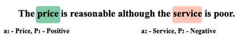
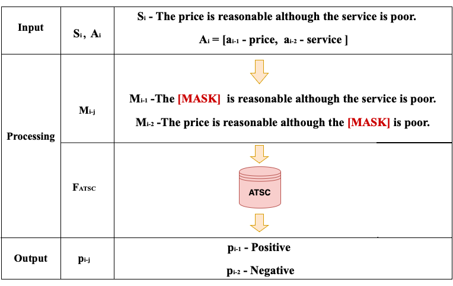
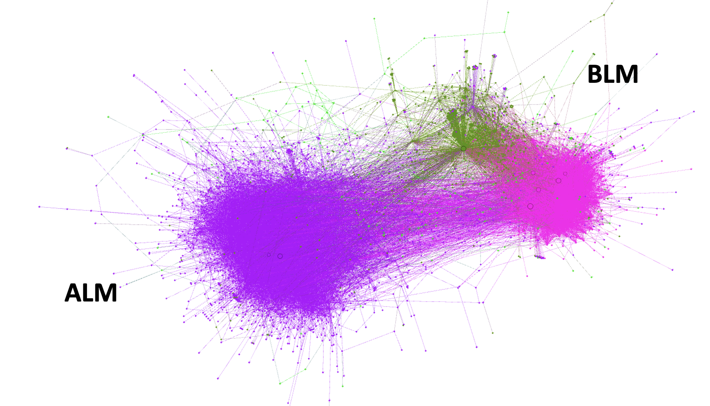

# Masking The Bias : From Echo Chambers to Large Scale Aspect-Based Sentiment Analysis
Welcome to the **Masked Aspect-Based Sentiment Analysis** repository. This project addresses the challenges of scarcity and high costs associated with manual annotation in Aspect-Based Sentiment Analysis (ABSA) by utilizing weak supervision methods. We have demonstrated the superiority of our model using SemEval datasets and real-world tweet data.

## Masked Aspect Sentiment Classification (MASC)

## Weak Supervision Method

## Datasets

## Contiributions and Feedback
We encourage contributions and feedback to improve this project. If you have suggestions or want to contribute, please open an issue or pull request on our GitHub repository.

## Citation

